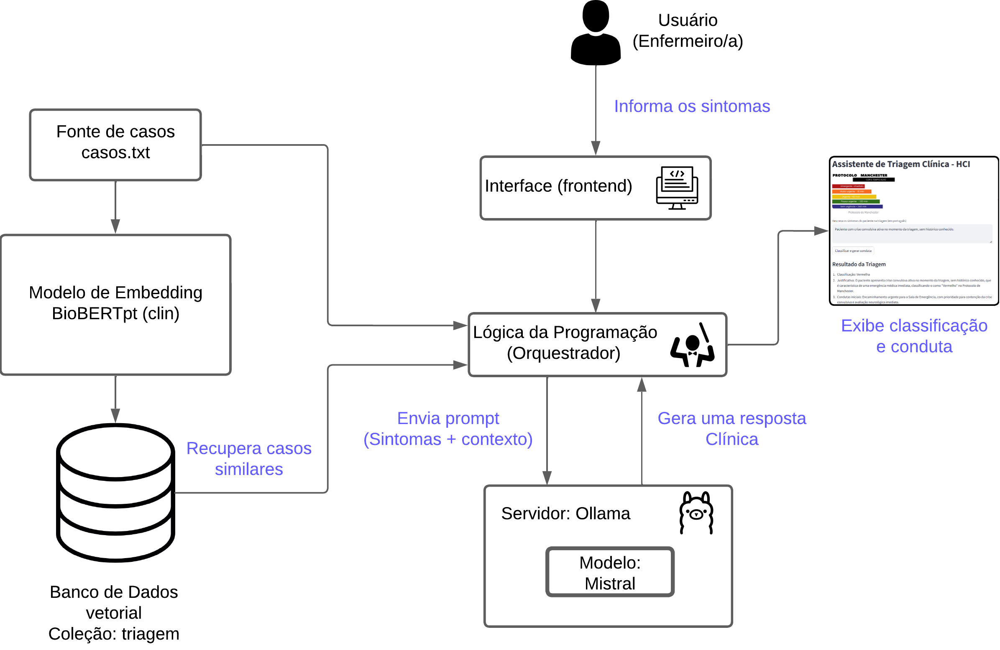

# Assistente de IA para Triagem Clínica

Este projeto consiste em um assistente inteligente de triagem clínica. Ele aplica a técnica de **Geração Aumentada por Recuperação (RAG)** para analisar sintomas: utiliza **embeddings do BioBERTpt(clin)** para buscar casos semelhantes no **ChromaDB** e, com base nesse contexto, usa o modelo local **Mistral (via Ollama)** para sugerir a conduta e a classificação conforme o **Protocolo de Manchester**.

---

## Visão Geral

O assistente recebe **sintomas clínicos** como entrada, busca **casos semelhantes** em um banco vetorial e classifica o paciente conforme o **Protocolo de Manchester**, fornecendo também **condutas iniciais**.

### Funcionamento geral do assistente

O código implementa uma aplicação de **RAG**. A arquitetura é dividida nas seguintes partes principais:

1. **Interface do Usuário (Frontend) & Orquestração:**
* **Streamlit (`st`):** Responsável por criar a interface web onde o profissional de saúde insere os sintomas e visualiza o resultado da triagem.
* **Lógica da Aplicação Python:** O script principal atua como o orquestrador. Ele gerencia o fluxo de dados, aciona o modelo de embedding, consulta o banco de dados vetorial, monta o prompt enriquecido e chama o LLM.


2. **Sistema de Ingestão e Recuperação (Retrieval System):**
* **Fonte de Dados (`casos.txt`):** Um arquivo de texto contendo casos clínicos históricos usados como base de conhecimento inicial.
* **Modelo de Embedding (`pucpr/biobertpt-clin`):** Um modelo BERT pré-treinado especificamente para o domínio clínico em português, utilizando a biblioteca `transformers` e `torch`. Sua função é converter textos médicos (sintomas) em representações numéricas (vetores/embeddings) que capturam seu significado semântico.
* **Banco de Dados Vetorial (ChromaDB):** Um banco de dados especializado (`chromadb`) que armazena os embeddings dos casos históricos. Ele permite realizar buscas por similaridade semântica, encontrando os casos no banco que matematicamente mais se assemelham aos sintomas do novo paciente.


3. **Sistema de Geração (Generation System):**
* **Servidor LLM (Ollama):** A plataforma `Ollama` é usada para hospedar e executar o modelo de linguagem grande localmente.
* **Modelo de Linguagem (Mistral):** O modelo de IA (`mistral`) que atua como o "cérebro" da operação. Ele recebe o prompt estruturado (contendo as instruções do protocolo de Manchester, os sintomas atuais e os casos similares recuperados) e gera a classificação de risco final, a justificativa e a conduta sugerida. O `LlamaIndex` é usado como ponte para conectar o código Python ao Ollama.


### Resumo do Fluxo de Dados

1. **Setup:** Ao iniciar, o sistema carrega os modelos e lê o arquivo `casos.txt`, convertendo os casos em vetores e salvando-os no ChromaDB (se ainda não existirem).
2. **Entrada:** O usuário digita os sintomas no Streamlit.
3. **Vetorização:** O texto dos sintomas é convertido em um vetor pelo modelo BioBERTpt.
4. **Busca:** Esse vetor é usado para consultar no ChromaDB os 3 casos históricos mais parecidos.
5. **Prompting:** A aplicação cria um prompt complexo que inclui: a persona do assistente, os sintomas do paciente e o texto dos 3 casos similares encontrados (contexto).
6. **Inferência:** Esse prompt é enviado ao modelo Mistral (via Ollama).
7. **Saída:** O modelo gera a resposta clínica, que é exibida na tela do Streamlit.



### Cores e classificações do Protocolo de Manchester


---

## Pré-requisitos

- **Sistema operacional:** Windows 10 ou superior  
- **Memória RAM recomendada:** 8 GB ou mais  
- **Espaço em disco:** 10 GB ou mais  

---

## Etapas de Instalação

### 1. Instalar o Ollama

> O Ollama roda modelos LLM localmente. Requer suporte à virtualização.

- Baixe: [https://ollama.com/download](https://ollama.com/download)
- Após a instalação, teste no terminal:

```bash
ollama list
```

---

### 2. Baixar o modelo `mistral`

```bash
ollama pull mistral
```

> Obs.: O modelo `llama3` pode exigir mais memória RAM.

---

### 3. Instalar Python 3.10.x

- Baixe: [Python 3.10.11](https://www.python.org/ftp/python/3.10.11/python-3.10.11-amd64.exe)
- Marque a opção **Add Python to PATH**
- Verifique a versão instalada:

```bash
python --version
```

---

### 4. Criar ambiente virtual

```powershell
python -m venv venv310
.\venv310\Scripts\Activate.ps1
```

---

### 5. Instalar dependências

```bash
pip install --upgrade pip
pip install streamlit
pip install llama-index
pip install chromadb
pip install sentence-transformers
pip install nest_asyncio
pip install torch torchvision torchaudio --index-url https://download.pytorch.org/whl/cu118
python.exe -m pip install --upgrade pip
pip install --upgrade llama-index
pip install llama-index-llms-ollama
```

---

## Executar o Aplicativo

```powershell
streamlit run app-bd-clin.py
```

Abra o navegador em:

[http://localhost:8501](http://localhost:8501)

---

## Interface Esperada

- Campo para **descrição dos sintomas**
- Botão **“Classificar e gerar conduta”**
- Resultado com:
  - **Classificação de risco**
  - **Justificativa clínica**
  - **Condutas iniciais recomendadas**

#### Exemplo da interface em execução:


---

## Visualizar dados com DB Browser for SQLite

1. Baixe: [https://sqlitebrowser.org](https://sqlitebrowser.org)
2. Abra o diretório `./chroma_db/`
3. Execute consultas SQL como:

```sql
SELECT * FROM collections;
SELECT * FROM embeddings;
SELECT * FROM embeddings_queue;
```

---

## Exemplos de Casos Armazenados

```text
case_0: Paciente do sexo masculino, 58 anos, com dor torácica intensa...
case_7: Paciente com falta de ar aos mínimos esforços, tosse produtiva...
case_15: Paciente com dispneia súbita, cianose e confusão...
case_19: Paciente com perda súbita de força no braço esquerdo...
```

---

## Links Úteis

- [LlamaIndex](https://docs.llamaindex.ai/en/stable/)
- [ChromaDB](https://docs.trychroma.com/)
- [Ollama](https://ollama.com/)
- [Streamlit](https://streamlit.io/)
- [BioBERTpt(clin)](https://aclanthology.org/2020.clinicalnlp-1.7.pdf)
