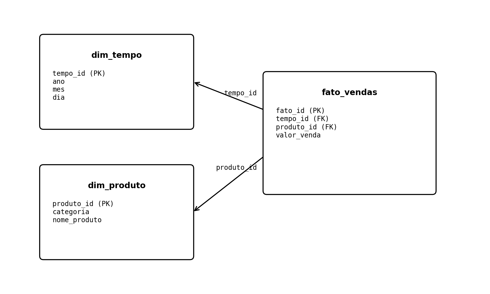

# Metabase — BI Local com MySQL (Data Warehouse em Estrela)

## Objetivo

Demonstrar como:

* Criar um **Data Warehouse em estrela no MySQL**
* Carregar dados a partir de arquivos CSV
* Instalar e configurar o **Metabase localmente no Ubuntu**
* Conectar o Metabase ao DW
* Realizar análises OLAP básicas (agregações, dimensões, métricas)
* Criar **gráficos e dashboards interativos**

---

## Descrição

O ambiente final consiste em:

* **MySQL** como banco do Data Warehouse
* **Modelo estrela**, com:

  * 1 tabela fato (`fato_vendas`)
  * 2 dimensões (`dim_produto`, `dim_tempo`)
* **Metabase** como ferramenta de BI/OLAP
* Consultas visuais sem necessidade de SQL

Arquitetura lógica:

```
CSV → MySQL (DW estrela) → Metabase → Gráficos → Dashboards
```

---

## Pré-requisitos

### Sistema Operacional

* Ubuntu 22.04 ou 24.04

### Software

* MySQL 8+
* Java **11**
* Metabase (arquivo `.jar`)

---

## Instalação

### 1. Instalar Java 11

```bash
sudo apt update
sudo apt install -y openjdk-11-jre
java -version
```

Se necessário, selecione o Java 11 como padrão:

```bash
sudo update-alternatives --config java
```

---

### 2. Baixar o Metabase

```bash
sudo mkdir -p /opt/metabase
sudo chown -R $USER:$USER /opt/metabase
cd /opt/metabase

wget https://downloads.metabase.com/latest/metabase.jar
```

---

### 3. Executar o Metabase

```bash
cd /opt/metabase
java -jar metabase.jar
```

Acesse no navegador:

```
http://localhost:3000
```

---

## Criação do Data Warehouse no MySQL

### 1. Criar banco de dados

```sql
CREATE DATABASE dw_vendas;
USE dw_vendas;
```

---

### 2. Criar tabelas (modelo estrela)

**`sql/01_create_dw.sql`**

```sql
CREATE TABLE dim_produto (
  id INT PRIMARY KEY,
  nome_produto VARCHAR(100),
  categoria VARCHAR(50)
);

CREATE TABLE dim_tempo (
  id INT PRIMARY KEY,
  ano INT,
  mes INT,
  nome_mes VARCHAR(20)
);

CREATE TABLE fato_vendas (
  id INT PRIMARY KEY,
  produto_id INT,
  tempo_id INT,
  quantidade INT,
  valor_venda DECIMAL(10,2),
  FOREIGN KEY (produto_id) REFERENCES dim_produto(id),
  FOREIGN KEY (tempo_id) REFERENCES dim_tempo(id)
);
```

---

## Modelo Estrela do Data Warehouse

A Figura a seguir apresenta o **modelo estrela do DW de vendas**, destacando a tabela fato e suas dimensões, conforme implementado no MySQL.



---

### 3. Carga de dados via CSV

**`sql/02_load_data.sql`**

```sql
LOAD DATA LOCAL INFILE 'dim_produto.csv'
INTO TABLE dim_produto
FIELDS TERMINATED BY ','
IGNORE 1 LINES;

LOAD DATA LOCAL INFILE 'dim_tempo.csv'
INTO TABLE dim_tempo
FIELDS TERMINATED BY ','
IGNORE 1 LINES;

LOAD DATA LOCAL INFILE 'fato_vendas.csv'
INTO TABLE fato_vendas
FIELDS TERMINATED BY ','
IGNORE 1 LINES;
```

> Certifique-se de que o MySQL permita `LOCAL INFILE`.

---

## Conexão do Metabase com o MySQL

1. **Admin settings → Databases → Add database**
2. Tipo: **MySQL**
3. Host: `localhost`
4. Porta: `3306`
5. Banco: `dw_vendas`
6. Usuário: `root`
7. Salvar

O Metabase fará o **sync automático** das tabelas.

---

## Modelagem no Metabase (passo essencial)

No **Admin → Data Model**:

1. Marque as **Primary Keys**:

   * `dim_produto.id`
   * `dim_tempo.id`

2. Marque as **Foreign Keys**:

   * `fato_vendas.produto_id → dim_produto.id`
   * `fato_vendas.tempo_id → dim_tempo.id`

Isso permite análises sem escrever JOIN manual.

---

## Exemplos de Análises

### 1. Vendas por mês

* Métrica: `SUM(valor_venda)`
* Dimensão: `dim_tempo.mes`
* Gráfico: Linha ou barras

---

### 2. Produto × Mês × Valor de venda

Configuração correta no Metabase:

* Eixo X: `mes`
* Métrica: `SUM(valor_venda)`
* Série (cores): `nome_produto`
* Tipo: **Line chart** ou **Stacked bar**

---

## Dashboards

Após a criação das análises, é possível organizá-las em um **dashboard interativo**, conforme ilustrado a seguir.


### Passos

1. **Dashboards → New**
2. Adicione perguntas salvas
3. Crie filtros globais:

   * Mês
   * Produto
   * Categoria

---
