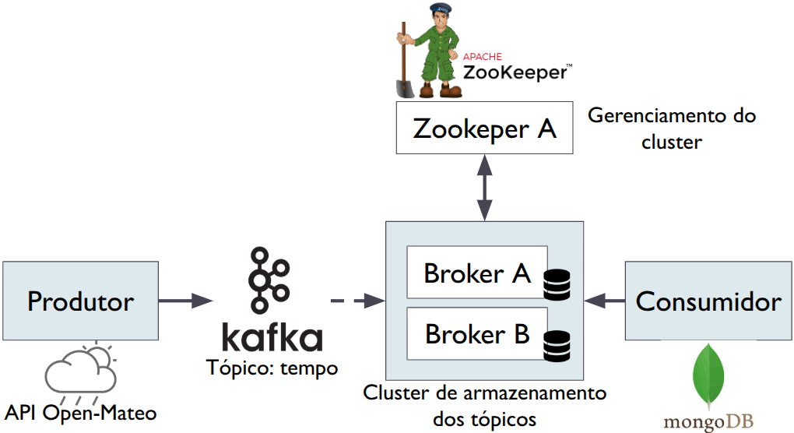

# Configuração do Apache Kafka com Ingestão de Dados da API Open-Meteo no MongoDB - (Windows 11)

## **Objetivo**

Criar uma pipeline de ingestão de dados em tempo real utilizando o Apache Kafka como sistema de mensagens distribuídas, a API Open-Meteo como fonte de dados climáticos em tempo real, e o MongoDB como banco de dados de armazenamento persistente. A arquitetura permite que dados climáticos atualizados periodicamente sejam enviados por um script Python ao Kafka, processados por um conector específico, e armazenados automaticamente no MongoDB.

Essa arquitetura simula um cenário comum em aplicações de cidades inteligentes, monitoramento ambiental e IoT, onde sensores ou serviços externos produzem dados continuamente que precisam ser processados e armazenados em tempo real.

---

## 1. Fluxo da pipeline de Ingestão de Dados com Apache Kafka

A Figura a seguir mostra a pipeline completa da ingestão de dados meteorológicos usando Open-Meteo, Apache Kafka e MongoDB:



Os papéis dentro do Apache Kafka são definidos conforme os seguintes componentes:

### **Produtor (Producer)**

**Quem é:** o script Python `open-meteo-to-kafka.py`, executado com a biblioteca `confluent-kafka`.

**Função:**
* Requisita dados da API Open-Meteo
* Publica esses dados no tópico Kafka chamado `tempo`

---

### **Tópico Kafka**

**Quem é:** o tópico chamado `tempo`, criado com o comando `kafka-topics.bat`.

**Função:**
* Atua como o canal de comunicação assíncrona entre o produtor e o(s) consumidor(es)
* Armazena as mensagens publicadas até que sejam consumidas

---

### **Consumidor (Consumer)**

**Quem é:** o MongoDB Kafka Sink Connector é executado via Kafka Connect.

**Função:**
* Consome os dados do tópico `tempo`
* Insere automaticamente os documentos recebidos na coleção `tempo_now` do banco MongoDB `clima_db`

---

## **2. Ferramentas e Tecnologias utilizadas**

### **Apache Kafka**

* **Para que serve:** é uma plataforma de streaming distribuída usada para construir pipelines de dados em tempo real. Ele permite que dados sejam publicados (produzidos) e consumidos.
* **No projeto:** atua como um intermediário onde os dados climáticos são enviados (produzidos) e depois encaminhados para outros destinos, como o MongoDB.

---

### **Apache Zookeeper**

**Para que serve:** é um serviço centralizado de coordenação e gerenciamento de metadados usado por sistemas distribuídos, como o Apache Kafka. Ele gerencia a configuração do cluster Kafka, detecta falhas em brokers, coordena a eleição de líderes e mantém a consistência entre os nós.

**No projeto:** é responsável por coordenar e manter o estado do cluster Kafka, garantindo que os brokers estejam sincronizados e que o tópico `tempo` esteja disponível para os produtores e consumidores. Seu funcionamento é essencial para a disponibilidade do sistema Kafka como um todo.

---

### **Open-Meteo API**

* **Para que serve:** Open-Meteo (https://open-meteo.com/) é uma API pública que fornece dados meteorológicos atualizados, como temperatura, direção e velocidade do vento.
* **No projeto:** serve como a fonte de dados em tempo real, de onde o script Python coleta informações para publicar no Kafka.

---

### **Script Python com confluent-kafka**

* **Para que serve:** `confluent-kafka` é uma biblioteca Python que permite a comunicação com o Apache Kafka (produção e consumo de mensagens).
* **No projeto:** o script consulta a API Open-Meteo periodicamente, formata os dados e os envia para o tópico Kafka chamado `tempo`. Esse script deve rodar dentro de um ambiente virtual Python com a biblioteca instalada. Aqui estamos aproveitando e utilizando o mesmo ambiente virtual criado para o projeto Assistente de IA.

---

### **MongoDB**

* **Para que serve:** MongoDB é um banco de dados NoSQL baseado em documentos.
* **No projeto:** Recebe e armazena os dados climáticos processados pelo conector Kafka MongoDB Sink, permitindo que os dados fiquem disponíveis para consultas, dashboards ou outros tipos de análises.

---

### **MongoDB Kafka Sink Connector**

* **Para que serve:** é um componente do Kafka Connect que move dados entre o Kafka e sistemas externos.
* **No projeto:** este conector específico pega os dados do tópico `tempo` e os envia automaticamente para uma coleção MongoDB.

---

### **Kafka Connect**

* **Para que serve:** é um framework da plataforma Kafka que gerencia conectores para integração com bancos de dados, sistemas de arquivos, serviços web, etc.
* **No projeto:** executa o MongoDB Sink Connector, responsável por transferir os dados do tópico Kafka para o banco MongoDB.

---

## 3. Instalar e Configurar o Apache Kafka

### Visão Geral da Configuração

Os passos a seguir mostram como configurar dois **servidores Kafka** (chamados de *brokers*) e um **gerenciador central** chamado *Zookeeper*, que ajuda os brokers a se comunicarem e manterem o sistema organizado.

Como abrir manualmente todos esses serviços seria trabalhoso, utilizamos **arquivos `.bat`** (scripts do Windows) que funcionam como atalhos para iniciar tudo com dois cliques. Esses arquivos são criados com comandos simples no prompt usando `echo`.

Também criamos dois **tópicos** Kafka, que funcionam como *canais de comunicação*: `customer_topic` e `product_topic`.

Depois, iniciamos dois tipos de programas:

- **Producer**: envia mensagens para um tópico.
- **Consumer**: recebe mensagens desse mesmo tópico.

Por exemplo, ao digitar uma frase no producer, ela aparece no consumer, confirmando que a comunicação está funcionando corretamente.

No final (seção 5.4), esse processo permite verificar que o Kafka foi instalado com sucesso e está pronto para ser usado na troca de mensagens entre diferentes sistemas ou partes de um software.


### 3.1. Download

* Acesse: [https://kafka.apache.org/downloads](https://kafka.apache.org/downloads)
* Baixe a última versão binária para Windows
* Extraia o arquivo em `C:/Kafka/application`

### 3.2. Estrutura de Pastas

Crie a seguinte estrutura:

```
C:/Kafka/
|-- application/          # Conteúdo do Kafka extraído
|-- data/zookeeper/
|-- tmp/kafka-logs/1/
|-- tmp/kafka-logs/2/
|-- batch/
```

Comandos para criar:

```bat
C:
mkdir C:\Kafka\application
mkdir C:\Kafka\data\zookeeper
mkdir C:\Kafka\tmp\kafka-logs\1
mkdir C:\Kafka\tmp\kafka-logs\2
mkdir C:\Kafka\batch
```

## 4. Configuração dos Servidores Kafka

### 4.1. Crie os arquivos de configuração

Copie `server.properties` duas vezes e renomeie como:

```
C:/Kafka/application/config/server1.properties
C:/Kafka/application/config/server2.properties
```

### 4.2. Edite `server1.properties`

```properties
broker.id=1
listeners=PLAINTEXT://:9092
log.dirs=C:/Kafka/tmp/kafka-logs/1
num.partitions=2
```

### 4.3. Edite `server2.properties`

```properties
broker.id=2
listeners=PLAINTEXT://:9093
log.dirs=C:/Kafka/tmp/kafka-logs/2
num.partitions=2
```

### 4.4. Edite `zookeeper.properties`

```properties
dataDir=C:/Kafka/data/zookeeper
```

## 5. Criar Batch Files a partir do prompt

Execute os comandos abaixo no prompt para criar scripts `.bat` que poderão ser executados posteriormente:

- `echo`: escreve o texto na saída.
- `>`: redireciona a saída do `echo` para um arquivo.

### Exemplo: Iniciar o Zookeeper com um script `.bat`

O comando `.bat` abaixo cria uma nova janela de terminal e inicia o servidor Zookeeper com as configurações definidas:

```bat
start C:\Kafka\application\bin\windows\zookeeper-server-start.bat C:\Kafka\application\config\zookeeper.properties
````

**Explicação do comando:**

* `start`: inicia o comando em uma nova janela do prompt do Windows.
* `C:\Kafka\application\bin\windows\zookeeper-server-start.bat`: script do Kafka responsável por iniciar o servidor Zookeeper.
* `C:\Kafka\application\config\zookeeper.properties`: caminho para o arquivo de configuração do Zookeeper, onde estão definidas opções como porta, diretório de dados e tempo de timeout.


### 5.1. Inicializar Zookeeper e Brokers

#### Zookeeper
```bat
echo start C:\Kafka\application\bin\windows\zookeeper-server-start.bat C:\Kafka\application\config\zookeeper.properties > C:\Kafka\batch\Start_Zookeeper.bat
```
#### Kafka Servers
```bat
echo start C:\Kafka\application\bin\windows\kafka-server-start.bat C:\Kafka\application\config\server1.properties > C:\Kafka\batch\Start_Kafka_Server1.bat

echo start C:\Kafka\application\bin\windows\kafka-server-start.bat C:\Kafka\application\config\server2.properties > C:\Kafka\batch\Start_Kafka_Server2.bat
```


### 5.2. Criar Tópicos

#### Vamos criar dois tópicos para teste:

- Batch para criar o tópico `customer_topic`:

#### customer_topic

```bat
echo start C:\Kafka\application\bin\windows\kafka-topics.bat --create --bootstrap-server localhost:9092 --replication-factor 2 --partitions 2 --topic customer_topic > C:\Kafka\batch\Create_customer_topic.bat
````

* Batch para criar o tópico `product_topic`:

#### product_topic

```bat
echo start C:\Kafka\application\bin\windows\kafka-topics.bat --create --bootstrap-server localhost:9092 --replication-factor 2 --partitions 2 --topic product_topic > C:\Kafka\batch\Create_product_topic.bat
```

---

### 5.3. Producers e Consumers

#### Vamos agora iniciar os serviços de **producer** e **consumer** para enviar e receber mensagens através do Kafka broker (`customer_topic`):

* Batch para inicializar o serviço de producer para o tópico `customer_topic`:

#### Producer Customer
```bat
echo start C:\Kafka\application\bin\windows\kafka-console-producer.bat --topic customer_topic --broker-list localhost:9092,localhost:9093 > C:\Kafka\batch\Producer_customer_topic.bat
```

* Batch para iniciar o serviço de consumer para o tópico `customer_topic`:

#### Consumer Customer
```bat
echo start C:\Kafka\application\bin\windows\kafka-console-consumer.bat --bootstrap-server localhost:9092 --from-beginning --topic customer_topic > C:\Kafka\batch\Consumer_customer_topic.bat
```

#### Agora vamos repetir o processo para o tópico `product_topic`:

* Batch para inicializar o serviço de producer para o tópico `product_topic`:

#### Producer Product
```bat
echo start C:\Kafka\application\bin\windows\kafka-console-producer.bat --topic product_topic --broker-list localhost:9092,localhost:9093 > C:\Kafka\batch\Producer_product_topic.bat
```

* Batch para iniciar o serviço de consumer para o tópico `product_topic`:

#### Consumer Product
```bat
echo start C:\Kafka\application\bin\windows\kafka-console-consumer.bat --bootstrap-server localhost:9092 --from-beginning --topic product_topic > C:\Kafka\batch\Consumer_product_topic.bat
```

---

### 5.4. Descrever Tópicos

#### Vamos verificar e descrever o status dos tópicos no Kafka:

* Batch para descrever o status do Kafka para o tópico `customer_topic`:

#### Status customer_topic
```bat
echo start C:\Kafka\application\bin\windows\kafka-topics.bat --describe --bootstrap-server localhost:9092 --topic customer_topic > C:\Kafka\batch\Status_customer_topic.bat
```

* Batch para descrever o status do Kafka para o tópico `product_topic`:

#### Status product_topic
```bat
echo start C:\Kafka\application\bin\windows\kafka-topics.bat --describe --bootstrap-server localhost:9092 --topic product_topic > C:\Kafka\batch\Status_product_topic.bat
```


## 6. Instalação Manual do Conector MongoDB Sink (Windows)

### 6.1. Baixar e extrair

* Acesse: [https://www.confluent.io/hub/mongodb/kafka-connect-mongodb](https://www.confluent.io/hub/mongodb/kafka-connect-mongodb)
* Baixe e extraia em: `C:/Kafka/application/connectors`

### 6.2. Configurar Kafka Connect

Edite `C:/Kafka/application/config/connect-standalone.properties`:

```properties
plugin.path=C:/Kafka/application/connectors
```

### 6.3. Iniciar Kafka Connect

```bat
C:\Kafka\application\bin\windows\connect-standalone.bat C:\Kafka\application\config\connect-standalone.properties
```

### 6.4. Criar `mongodb-sink.json`

Salve em `C:/Kafka/batch/mongodb-sink.json`:

```json
{
  "name": "mongodb-tempo-sink",
  "config": {
    "connector.class": "com.mongodb.kafka.connect.MongoSinkConnector",
    "tasks.max": "1",
    "topics": "tempo",
    "connection.uri": "mongodb://localhost:27017",
    "database": "clima_db",
    "collection": "tempo_now",
    "key.converter": "org.apache.kafka.connect.storage.StringConverter",
    "value.converter": "org.apache.kafka.connect.json.JsonConverter",
    "value.converter.schemas.enable": "false"
  }
}
```

### 6.5. Registrar o Conector

No prompt, execute o comando para criar o arquivo `start_mongodb_sink.bat`:

```bat
curl -X POST -H "Content-Type: application/json" ^
     --data @C:\Kafka\batch\mongodb-sink.json ^
     http://localhost:8083/connectors
```

## 7. Ingestão de Dados com API Open-Meteo

### 7.1. Criar Ambiente Python

Aqui estou aproveitando o mesmo ambiente criado na atividade do Assistente de IA.

```ps1
cd "C:\Users\SEU_USUARIO\Documents\Projetos\AgenteIA"
python -m venv venv310
.\venv310\Scripts\Activate.ps1
```

### 7.2. Instalar dependências

```bash
python -m pip install confluent-kafka requests
```

### 7.3. Criar `open-meteo-to-kafka.py`

```python
import time
import json
import requests
from confluent_kafka import Producer

producer = Producer({'bootstrap.servers': 'localhost:9092'})
TOPICO = 'tempo'

def enviar_dados():
    while True:
        r = requests.get("https://api.open-meteo.com/v1/forecast?latitude=-29.171&longitude=-53.5&current_weather=true")
        if r.status_code == 200:
            tempo = r.json().get("current_weather", {})
            tempo["timestamp"] = time.strftime('%Y-%m-%dT%H:%M:%S')
            producer.produce(TOPICO, value=json.dumps(tempo))
            producer.flush()
            print("Enviado:", tempo)
        time.sleep(10)

if __name__ == "__main__":
    enviar_dados()
```

### 7.4. Executar Script

```bash
python C:\Kafka\batch\open-meteo-to-kafka.py
```

## 8. Verificar Dados no MongoDB Compass

1. Conecte-se a:

   ```
   Utilizar o MongoDB Compass ou mongosh no terminal
   ```
2. Acesse o banco:

   ```
   use clima_db
   ```
3. Veja a coleção:

   ```
   db.tempo_now.find()
   ```

Exemplo de documento:

```json
{
  "weathercode": 3,
  "temperature": 21,
  "windspeed": 11.3,
  "is_day": 1,
  "interval": 900,
  "time": "2025-06-04T16:45",
  "winddirection": 301,
  "timestamp": "2025-06-04T13:55:41"
}
```
---

**Link para documentação oficial**:

   * Apache Kafka: [https://kafka.apache.org/documentation/](https://kafka.apache.org/documentation/)
   * Kafka Connect: [https://docs.confluent.io/home/connect/index.html](https://docs.confluent.io/home/connect/index.html)
   * MongoDB Connector: [https://www.confluent.io/hub/mongodb/kafka-connect-mongodb](https://www.confluent.io/hub/mongodb/kafka-connect-mongodb)

---


