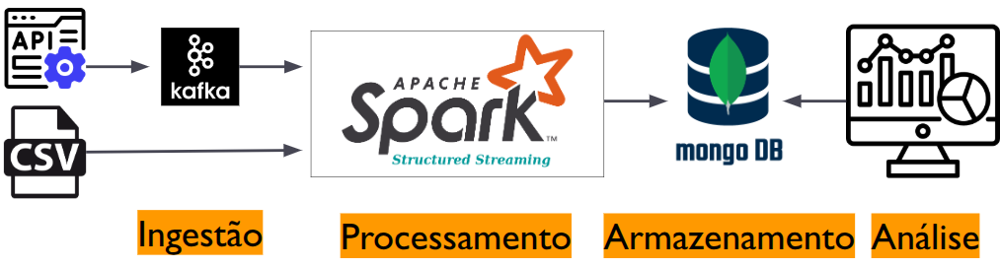

# Pipeline com integração Kafka + Spark + MongoDB para Processamento de Dados de Vendas - (Ubuntu 24.04)

## Objetivo

Configurar uma pipeline de Big Data com Apache Kafka, Apache Spark e MongoDB em um ambiente Linux Ubuntu. O objetivo é ingerir dados de vendas (de uma API em tempo real ou CSV em batch), processá-los com o Spark e armazenar os resultados no MongoDB.

Cenário prático: medir o desempenho organizacional com base nos dados de vendas.

---

## Arquitetura Geral da pipeline



* **Ingestão**: Dados entram via CSV ou API e são enviados para Kafka.
* **Processamento**: O Spark consome do Kafka, calcula totais e médias.
* **Armazenamento**: Dados agregados são salvos no MongoDB.
* **Análise**: Os dados persistidos estão prontos para dashboards e APIs.

---

## 1. Configuração Inicial do Ambiente Ubuntu

### 1.1 Atualizar o sistema

```bash
sudo apt update && sudo apt upgrade -y
```

### 1.2 Instalar Java

```bash
sudo apt install openjdk-11-jdk -y
java -version
```

### 1.3 Instalar MongoDB

```bash
sudo apt install mongodb -y
sudo systemctl start mongod
sudo systemctl enable mongod
mongosh
```

---

## 2. Instalar e Configurar o Apache Kafka

### 2.1 Baixar e extrair Kafka

```bash
wget https://downloads.apache.org/kafka/3.5.3/kafka_2.13-3.5.3.tgz
tar -xvf kafka_2.13-3.5.3.tgz
sudo mv kafka_2.13-3.5.3 /opt/kafka
```

### 2.2 Iniciar Zookeeper

```bash
cd /opt/kafka
bin/zookeeper-server-start.sh config/zookeeper.properties
```

### 2.3 Iniciar Kafka Broker

```bash
cd /opt/kafka
bin/kafka-server-start.sh config/server.properties
```

### 2.4 Criar tópico

```bash
bin/kafka-topics.sh --create --topic sales-topic --bootstrap-server localhost:9092 --partitions 1 --replication-factor 1
```

### 2.5 Testar produtor

```bash
bin/kafka-console-producer.sh --topic sales-topic --bootstrap-server localhost:9092
```

Digite:

```json
{"Produto": "Celular", "Categoria": "Eletrônicos", "Preco": 1300.00, "Quantidade": 5}
```

### 2.6 Testar consumidor

```bash
bin/kafka-console-consumer.sh --topic sales-topic --from-beginning --bootstrap-server localhost:9092
```

---

## 3. Instalar e Configurar o Apache Spark

### 3.1 Instalar Spark

```bash
wget https://dlcdn.apache.org/spark/spark-3.5.3/spark-3.5.3-bin-hadoop3.tgz
tar -xvf spark-3.5.3-bin-hadoop3.tgz
sudo mv spark-3.5.3-bin-hadoop3 /opt/spark
```

### 3.2 Configurar ambiente

Edite `~/.bashrc`:

```bash
export SPARK_HOME=/opt/spark
export PATH=$SPARK_HOME/bin:$SPARK_HOME/sbin:$PATH
export JAVA_HOME=/usr/lib/jvm/java-11-openjdk-amd64
```

Recarregue:

```bash
source ~/.bashrc
```

### 3.3 Testar

```bash
spark-shell
```

---

## 4. Criar e Executar Scripts de Processamento

### 4.1 `sales_processing.py` (batch com CSV)

Executar:

```bash
spark-submit sales_processing.py
```

### 4.2 `kafka_spark_consumer.py` (stream Kafka)

Executar:

```bash
spark-submit --packages org.apache.spark:spark-sql-kafka-0-10_2.12:3.5.3 kafka_spark_consumer.py
```

### 4.3 `kafka_to_mongodb.py` (salvar no MongoDB)

Executar:

```bash
spark-submit --packages org.apache.spark:spark-sql-kafka-0-10_2.12:3.5.3,org.mongodb.spark:mongo-spark-connector_2.12:10.1.1 kafka_to_mongodb.py
```

### 4.4 `batch_sales_processing.py` (batch + MongoDB)

Executar:

```bash
spark-submit batch_sales_processing.py
```

---

## 5. Consultar Resultados no MongoDB

```bash
mongosh
use sales_db
db.total_sales.find().pretty()
db.average_sales.find().pretty()
```

---

## 6. Criar Ambiente Python para Producer

```bash
python3 -m venv kafka_env
source kafka_env/bin/activate
pip install kafka-python six confluent-kafka
```

---

## 7. Monitoramento com Spark UI

Acesse:

```
http://localhost:4040
```

---

## 8. Instruções de Execução da Pipeline

Execute os seguintes comandos em **terminais separados**:

### Terminal 1 - Iniciar o Zookeeper

```bash
cd /opt/kafka
bin/zookeeper-server-start.sh config/zookeeper.properties
```

### Terminal 2 - Iniciar o Servidor Kafka

```bash
cd /opt/kafka
bin/kafka-server-start.sh config/server.properties
```

### Terminal 3 - Criar o Tópico no Kafka (apenas na primeira execução)

```bash
cd /opt/kafka
bin/kafka-topics.sh --create --topic sales-topic --bootstrap-server localhost:9092
```

### Terminal 4 - Rodar o Produtor Kafka

```bash
source kafka_env/bin/activate
python kafka_producer.py
```

### Terminal 5 - Processamento em Tempo Real (Spark Streaming)

```bash
source kafka_env/bin/activate
spark-submit --packages org.apache.spark:spark-sql-kafka-0-10_2.12:3.5.3,org.mongodb.spark:mongo-spark-connector_2.12:10.1.1 kafka_spark_consumer.py
```

### Terminal 6 - Processamento em Lote (Spark Batch)

```bash
spark-submit --packages org.mongodb.spark:mongo-spark-connector_2.12:10.1.1 batch_sales_processing.py
```

### Terminal 7 - Consultar os Dados no MongoDB

```bash
mongosh
use sales_db
db.total_sales.find().pretty()
db.average_sales.find().pretty()
db.raw_sales_data.find().pretty()
```

### Terminal 8 - Visualização dos dados com Streamlit

```bash
source kafka_env/bin/activate
streamlit run app.py
```

---
