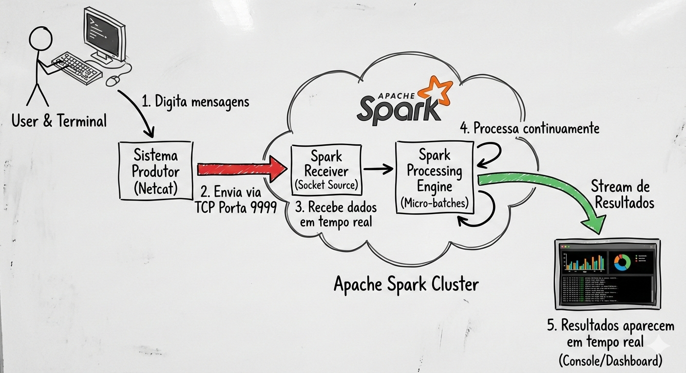

# Apache Spark – Processamento de Dados em Tempo Real 

Este repositório apresenta um **tutorial de instalação e configuração do Apache Spark no Ubuntu 24.04**, seguido de um **exemplo simples de processamento de dados em tempo real (streaming)**.

---

## Objetivo do exemplo

Demonstrar como o **Apache Spark** pode:

* receber **dados em tempo real**,
* processá-los continuamente,
* e gerar resultados.

O exemplo simula:

> **mensagens de redes sociais / comentários / manchetes**, chegando continuamente.

---

## Configuração do Ambiente

* Ubuntu **24.04 LTS**
* Apache Spark **3.5.8**
* Java **OpenJDK 11**
* Python **3.x**
* Execução local

---

## 1. Instalação do Apache Spark

### 1.1 Atualizar o sistema

```bash
sudo apt update && sudo apt upgrade -y
```

### 1.2 Instalar Java (se ainda não estiver instalado)

```bash
sudo apt install openjdk-11-jdk -y
```

Verifique:

```bash
java -version
```

---

### 1.3 Baixar o Spark

```bash
cd /tmp
wget https://downloads.apache.org/spark/spark-3.5.8/spark-3.5.8-bin-without-hadoop.tgz
```

---

### 1.4 Instalar no sistema

```bash
tar -xvzf spark-3.5.8-bin-without-hadoop.tgz
sudo mv spark-3.5.8-bin-without-hadoop /opt/spark
sudo chown -R $USER:$USER /opt/spark
```

---

### 1.5 Configurar variáveis de ambiente

Edite o arquivo:

```bash
nano ~/.bashrc
```

Adicione ao final:

```bash
export SPARK_HOME=/opt/spark
export PATH=$SPARK_HOME/bin:$SPARK_HOME/sbin:$PATH
```

Recarregue:

```bash
source ~/.bashrc
```

---

## 2. Verificação da instalação

```bash
spark-submit --version
```

Saída esperada:

```
Spark version 3.5.8
```

---

## 3. Exemplo de Streaming (Tempo Real)

Neste exemplo, o dado nasce no momento em que alguém digita uma mensagem. O Apache Spark não trabalha apenas com arquivos do passado, mas reage continuamente a informações que estão chegando agora, exatamente como acontece com comentários em redes sociais ou notícias em tempo real.

### Ideia simples

* Um terminal **envia mensagens em tempo real**
* O Spark **escuta essas mensagens**
* O Spark **conta as palavras em tempo real**

---

## 4. Criando a fonte de dados (mensagens em tempo real)

### Terminal 1

```bash
sudo apt install netcat-openbsd -y
nc -lk 9999
```

Tudo o que for digitado aqui será tratado como **dados em tempo real**.

Exemplos:

```
hoje teve chuva em ijui
gosto de cafe gosto de cafe
noticia urgente politica
```

---

## 5. Código Spark (PySpark Streaming)

Crie o arquivo:

```bash
nano streaming_palavras.py
```

Conteúdo:

```python
from pyspark.sql import SparkSession
from pyspark.sql.functions import explode, split, lower, col

# 1) Cria a sessão Spark
spark = SparkSession.builder \
    .appName("TendenciasAoVivo") \
    .getOrCreate()

# Reduzir logs para ficar mais "limpo"
spark.sparkContext.setLogLevel("WARN")

# 2) Lê um fluxo de texto vindo do socket (localhost:9999)
# Cada linha digitada no "nc -lk 9999" vira um registro.
linhas = spark.readStream \
    .format("socket") \
    .option("host", "localhost") \
    .option("port", 9999) \
    .load()

# 3) Quebra cada linha em palavras (tokens), coloca em minúsculo
palavras = linhas.select(
    explode(split(lower(col("value")), r"\s+")).alias("palavra")
)

# 4) Remove "vazios" (caso sejam digitados espaços)
palavras_limpas = palavras.filter(col("palavra") != "")

# 5) Conta as palavras em tempo real (ranking)
contagem = palavras_limpas.groupBy("palavra").count().orderBy(col("count").desc())

# 6) Mostra na tela continuamente (console)
# outputMode="complete" imprime a tabela completa atualizada a cada 5 segundos.
query = contagem.writeStream \
    .outputMode("complete") \
    .format("console") \
    .option("truncate", "false") \
    .trigger(processingTime="5 seconds") \
    .start()

query.awaitTermination()
```

---

## 6. Executando o processamento em tempo real

### Terminal 2

```bash
spark-submit streaming_palavras.py
```

A cada **5 segundos**, o Spark exibirá:

* quais palavras mais apareceram
* atualizando continuamente

---

## 7. Interface visual do Spark (Spark UI)

Enquanto o programa estiver rodando, acesse:

```
http://localhost:4040
```

**Importante:**
A Spark UI **só existe enquanto a aplicação está em execução**.

---

## Arquitetura do fluxo de dados (visual)



1. Usuário digita mensagens  
2. O sistema envia pela porta 9999  
3. O Spark recebe os dados em tempo real  
4. O Spark processa continuamente  
5. Resultados aparecem em tempo real  

---
