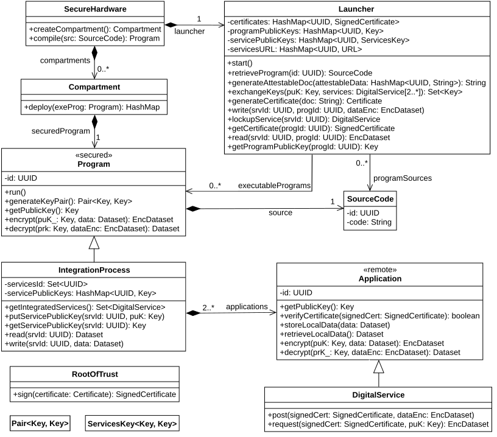

# iDevS API: Code Generator for Integration Processes in C

---

## Descrição Geral

Este projeto implementa uma ferramenta de **Engenharia Dirigida por Modelos (MDE)** baseada no **metamodelo iDevS API**, que permite gerar automaticamente código em linguagem C para processos de integração de serviços digitais, incluindo suporte a execução segura em **Trusted Execution Environments (TEEs)** como a arquitetura **CHERI/Morello**.

O pipeline parte de uma **DSL textual (iDevS)** que modela infraestrutura, processos, serviços e troca de chaves, transformando o modelo em código C compilável e executável.

---

## Objetivo do Projeto

- Reduzir o desenvolvimento manual de processos de integração.
- Fornecer uma linguagem de modelagem (DSL) formal e segura.
- Gerar código C automático, seguro, modular e compatível com ambientes com compartimentalização (CHERI/Morello).
- Facilitar a construção de pipelines de integração envolvendo APIs, bancos, filas, mensageria, etc.
- Implementar execução segura com isolamento, root of trust, assinatura, criptografia e attestation.

---

## Arquitetura e Metamodelo

O projeto é implementado com base no seguinte **metamodelo conceitual da iDevS API:**

---

### **Diagrama do Metamodelo**



---

**Descrição dos principais componentes:**

- **SecureHardware:** Define hardware seguro que pode criar compartimentos e compilar código protegido.
- **Compartment:** Compartimentos de memória que executam programas seguros.
- **SourceCode:** Código-fonte vinculado a programas seguros.
- **Program:** Programa seguro que executa operações criptográficas (gerar chave, encriptar, decriptar) e interage com serviços.
- **Launcher:** Gerencia certificados, troca de chaves, geração de attestations e orquestra os processos.
- **IntegrationProcess:** Descreve o pipeline de integração, etapas, serviços utilizados e troca de dados.
- **DigitalService & Application:** Serviços externos que interagem com o processo (APIs, bases, mensageria, etc.).
- **RootOfTrust:** Entidade que assina certificados e valida identidade dos participantes.

---

## Estrutura do Projeto

```plaintext
mde/
├── docs/                     # Documentação (diagrama e outros)
│   └── iDevS_Model.png
├── examples/                 # Modelos na DSL (*.idevs)
├── generated/                # Código C e Makefile gerados
├── grammar/                  # Gramática ANTLR da DSL (iDevS.g4)
├── src/                      # Código Python (parser, visitor, gerador)
├── templates/                # Templates Jinja2 para geração de C e Makefile
```

---

## Pré-requisitos

- **Java 8+** (para executar ANTLR)
- **Python 3.9+** (testado com Python 3.12)
- **Pacotes Python:**

```bash
pip install antlr4-python3-runtime jinja2
```

- **ANTLR 4.13.2**

Baixar:

```bash
wget https://www.antlr.org/download/antlr-4.13.2-complete.jar
```

---

## Pipeline de Execução Completo

---

### 1. Gerar Parser e Visitor a partir da gramática

```bash
cd mde
java -Xmx500M -cp antlr-4.13.2-complete.jar org.antlr.v4.Tool -Dlanguage=Python3 -visitor -o src grammar/iDevS.g4
```

Gera automaticamente:

```plaintext
src/iDevSParser.py
src/iDevSLexer.py
src/iDevSVisitor.py
```

---

### 2. Gerar o código C a partir do modelo `.idevs`

```bash
python -m src.code_generator
```

O código é gerado na pasta `/generated` contendo:

```plaintext
integration_process.c
integration_process.h
Makefile
```

---

### 3. Compilar o código C

```bash
cd generated
make
```

---

### 4. Executar

- Em Morello Board:

```bash
make run
```

---

## Sintaxe da DSL iDevS (Exemplo)

```plaintext
IntegrationSolution "PurchasePipeline" {
    Infrastructure {
        Launcher "MainLauncher"
        SecureHardware "MorelloBoard"
        Compartment "MainCompartment"
        RootOfTrust "GlobalCA"
        SourceCode "integration_process.c"
    }

    Services {
        API "Store" {
            url = "https://store.api.com"
        }
        API "Taxi" {
            url = "https://taxi.api.com"
        }
        API "Messaging" {
            url = "https://msg.api.com"
        }
    }

    KeysExchange {
        ProgramPublicKey "PurchaseFlow"
        ServicePublicKey "Store"
        ServicePublicKey "Taxi"
        ServicePublicKey "Messaging"
    }

    Process "PurchaseFlow" {
        uses ["Store", "Taxi", "Messaging"]

        Step "RetrievePurchase" {
            Read from Store
        }

        Step "CheckAndBook" {
            If "purchase >= 150" {
                Write to Taxi
                Write to Messaging
            }
        }

        Step "Archive" {
            Write to Messaging
        }
    }
}
```

---

## **Resultados Gerados**

Após executar o parser e o gerador, os seguintes arquivos são criados na pasta `/generated`:

| Arquivo                 | Descrição                               |
| ----------------------- | --------------------------------------- |
| `integration_process.c` | Implementação do processo de integração |
| `integration_process.h` | Protótipos de funções e estrutura       |
| `Makefile`              | Script de compilação                    |

---

### **Arquivo: integration\_process.c**

```c
#include "integration_process.h"
#include <stdio.h>

void main() {
    printf("Launcher: MainLauncher\n");
    printf("Connecting to Store at https://store.api.com\n");
    printf("Connecting to Taxi at https://taxi.api.com\n");
    printf("Connecting to Messaging at https://msg.api.com\n");

    printf("Running Process: PurchaseFlow\n");
    step_RetrievePurchase();
    step_CheckAndBook();
    step_Archive();
}

void step_RetrievePurchase() {
    printf("[Step] RetrievePurchase\n");
    printf(" - Read from Store\n");
}

void step_CheckAndBook() {
    printf("[Step] CheckAndBook\n");
    printf(" - If purchase >= 150\n");
    printf("   * Write to Taxi\n");
    printf("   * Write to Messaging\n");
}

void step_Archive() {
    printf("[Step] Archive\n");
    printf(" - Write to Messaging\n");
}
```

---

### **Arquivo: integration\_process.h**

```c
#ifndef INTEGRATION_PROCESS_H
#define INTEGRATION_PROCESS_H

void step_RetrievePurchase();
void step_CheckAndBook();
void step_Archive();

#endif
```

---

### **Arquivo: Makefile**

```Makefile
CC=clang-morello
CFLAGS=-march=morello+c64 -mabi=purecap -g

all: integration_process

integration_process: integration_process.c integration_process.h
	$(CC) $(CFLAGS) -o integration_process integration_process.c

run:
	proccontrol -m cheric18n -s enable ./integration_process

clean:
	rm -f integration_process
```

---

## Observações sobre os resultados

- O código gerado inclui todas as etapas (`Steps`) e ações (`Actions`) descritas no modelo `.idevs`.
- Gera funções C nomeadas como `step_<nome_da_step>()` para cada etapa.
- Inclui headers para modularidade e segurança no código.
- O `Makefile` é configurável, podendo ser adaptado tanto para ambientes Morello quanto para Linux padrão.
- O pipeline suporta geração incremental: qualquer novo processo descrito na DSL gera novo código automaticamente.

